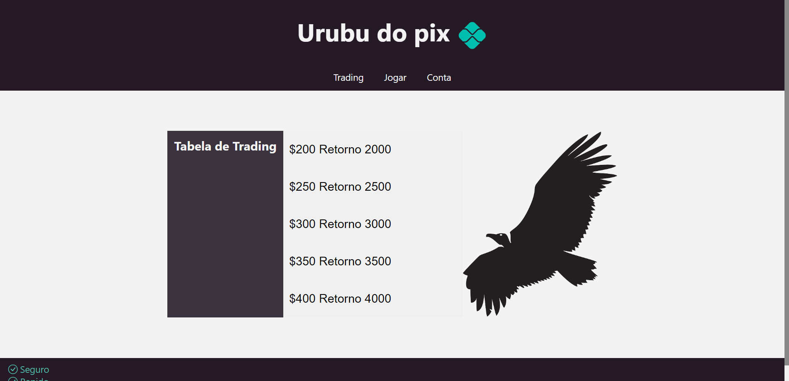

# Urubu do pix em PHP 8

projeto urubu do pix feito pelo simples html, css, javascript e para backend php



## Requisitos e como baixar o projeto🔨

Enviroment - não obgrigatorio

```
    Na raiz do projeto crie um ".env"
    O ambiente deve conter uma variavel chamada "DATA_BASE_NAME"
    A variavel recebe um nome para o banco de dados que por padrão e "db.sqlite3"
```
